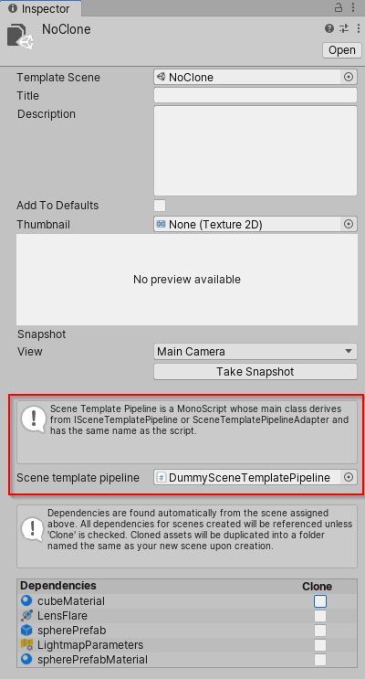

# Scene Template API

## Creating a new Scene Template

The Scene template package exposes 2 functions to create new scene template asset:

```CSharp
// Creates an empty Scene Template
SceneTemplate.CreateSceneTemplate(string sceneTemplatePath)
```

Or 

```CSharp
// Creates a Scene Template from a Scene
// The Scene template will already be bound to the provided scene and
// its dependencies will already be extracted.
SceneTemplate.CreateTemplateFromScene(SceneAsset sourceSceneAsset, string sceneTemplatePath);
```

## Instantiate a new Scene from a Template

The Scene Template package exposes a new way to create scene from script if you have an existing scene template:

```CSharp
Tuple<Scene, SceneAsset> SceneTemplate.Instantiate(SceneTemplateAsset sceneTemplate, bool loadAdditively, string newSceneOutputPath = null);
```

This function will instantiate a new scene from a scene template and returns the newly created `Scene` handle as well as its matchind `SceneAsset`. The scene can be created in additive mode. If the scene contains assets that needs to be cloned, you will need to provide a path for the new scene since it will need to be saved on disk.

## New Scene Instantiate Event

When a new scene is instantiated from a template (either by script using `SceneTemplate.Instantiate` or from the New Scene Dialog) an event will be fired:

```CSharp

public class SceneTemplate
{
    public delegate void NewTemplateInstantiated(SceneTemplateAsset sceneTemplateAsset, Scene scene, SceneAsset sceneAsset, bool additiveLoad);

    public static event NewTemplateInstantiated newSceneTemplateInstantiated;
}
```

This event will be fired after the template is instantiated. It will be fired after any `EditorSceneManager.newSceneCreated` or `EditorSceneManager.sceneOpened` have been fired.

## Scene Template Pipeline

You can attach a `ISceneTemplatePipeline` to an existing `SceneAssetTemplate` to ensure custom code is executed throughout the instantiation process. If you want to create a `SceneTemplatePipeline` you need to do the following:

1- Create a script with a class deriving from the `ISceneTemplatePipeline` interface (or the `SceneTemplatePipelineAdapter`). 
2- Implements the event you want to react to (ex: `BeforeTemplateInstantiation` or `AfterTemplateInstantiation`).
3- Set the `SceneTemplateAsset.templatePipeline` value to the your script. Either through the Inspector or through scripting.
4- Each time the template bound to your pipeline will be instantiated a new instance of the pipeline will be created.



```CSharp
using UnityEditor.SceneTemplate;
using UnityEngine;
using UnityEngine.SceneManagement;
public class DummySceneTemplatePipeline : ISceneTemplatePipeline
{
    public void BeforeTemplateInstantiation(SceneTemplateAsset sceneTemplateAsset, bool isAdditive, string sceneName)
    {
        if (sceneTemplateAsset)
        {
            Debug.Log($"Before Template Pipeline {sceneTemplateAsset.name} isAdditive: {isAdditive} sceneName: {sceneName}");
        }
    }

    public void AfterTemplateInstantiation(SceneTemplateAsset sceneTemplateAsset, Scene scene, bool isAdditive, string sceneName)
    {
        if (sceneTemplateAsset)
        {
            Debug.Log($"After Template Pipeline {sceneTemplateAsset.name} scene: {scene} isAdditive: {isAdditive} sceneName: {sceneName}");
        }
    }
}
```

# Scene Template Instantiation Sequence

Multiple file operations happens while instatiating a scene template containing Cloneable assets. Most of these operations trigger Unity Events that a user could listen to. Here is the event sequence and where to best react to a template being instantiated:

0. User clicks "Create" in the New Scene Dialog to instantiate a scene that contains Cloneable dependencies:
    - Scene Template asset is called: `testDependencies.asset`
    - Template scene is called `testDependencies.unity`
    - Template scene references a material (`blue.mat`) that needs to be cloned
    - New scene is called `MyNewSceneFromTemplate`
1. `ISceneTemplatePipeline.BeforeTemplateInstantiation` for the *template asset itself* is triggered
    - `testDependencies.asset` is bound to a `ISceneTemplatePipeline` script that gets triggered.
2. `SceneTemplate.NewTemplateInstantiating` is triggered
3. The scene referenced in the template is copied
    - `testDependencies.unity` is copied as `MyNewSceneFromTemplate.unity`.
4. All cloneable dependencies are copied in a folder next to the new scene.
    - `Assets/blue.mat` is copied as `MyNewSceneTemplate/blue.mat`
5. New Scene is opened in memory: 
    - `EditorSceneManager.sceneOpening` is triggered
    - `MonoBehavior.OnValidate` event is triggered on all `GameObject` implementing it. **Notice that this happens BEFORE remapping of cloneable assets.**
        - Basically `MyNewSceneTemplate.unity` still references `blue.mat`.
    - `EditorSceneManager.sceneOpened` is triggered.
6. Remapping to "cloned" asset reference happens.
    - In `MyNewSceneTemplate.unity` all references to `blue.mat` is remapped to `MyNewSceneTemplate/blue.mat`.
7. The newly instantiated and remapped scene is saved.
    - `MyNewSceneTemplate.unity` is saved.
    - `EditorSceneManager.sceneSaving` is triggered
    - `EditorSceneManager.sceneSaved` is triggered
8. `ISceneTemplatePipeline.AfterTemplateInstantiation` for the *template asset itself* is triggered
    - `testDependencies.asset` is bound to a `ISceneTemplatePipeline` script that gets triggered.
9. `SceneTemplate.NewTemplateInstantiated` is triggered


