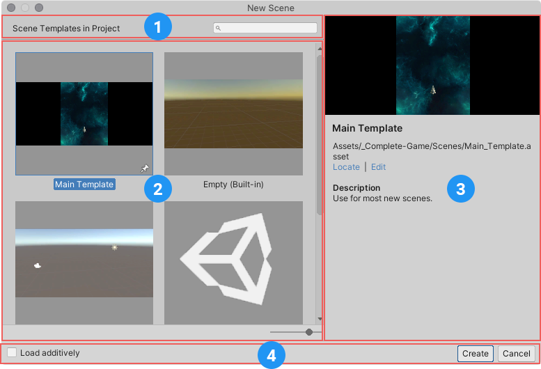
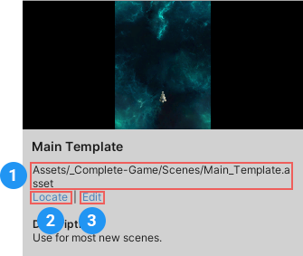

# Creating new Scenes from templates

To create a new Scene from a template, open the New Scene dialog (menu: **File > New Scene** or **Ctrl/Cmd + n**).

<br/>_The New Scene dialog_

1. **Search field:** find available Scene templates by name.
1. **Templates:** a list of all available templates in the Project.
1. **Template details:** displays information about the currently selected template.
1. **Command bar:** provides commands and options for creating a new Scene from the selected template.

## Creating a new Scene

To create a new Scene from a template:

1. Open the New Scene dialog (menu: **File > New Scene** or **Ctrl/Cmd + n**).
1. Select a template from the list.
1. If you want Unity to load the new Scene additively (see note below), enable **Load Additively**.
1. Click **Create** to create Scene.

> [!NOTE]
> Additive loading means that Unity loads the Scene in addition to any other Scenes you have open. For more information, see the Unity Manual documentation about [Multi-Scene editing](https://docs.unity3d.com/Manual/MultiSceneEditing.html).


If the template does not have any cloneable dependencies, Unity loads the new Scene in memory, but does not save it.

If the template has cloneable dependencies, Unity prompts you to choose a location in the Project to save it to. When you save the Scene, Unity creates a folder in the same location, and with the same name as the new Scene. It then clones the cloneable dependencies into the new folder, and updates the new Scene to use the cloned Assets instead of the original Assets used by the template Scene.


## Pinning templates

Pinned templates appear before other templates in the New Scene dialog's template list. The last template pinned appears at the top of the list.

Click any template's pin icon to pin it.


You can also pin a template when you [edit its properties](editing-scene-templates.md). In the Scene template Inspector, enable the **Pin in New Scene Dialog** option.

## Locating and editing templates

When you select a template in the New Scene dialog, the details pane displays the path to the template (1 in the image below).

Click the **Locate** link (2  in the image below) to highlight the template in the Project view.

Click the **Edit** link (3  in the image below) to open the template in an Inspector window and [edit its properties](editing-scene-templates.md).




## Creating new Scenes from templates using C&#35; scripts

To create a new Scene from a template from a C&#35; script, use the [**Instantiate** method](../api/UnityEditor.SceneTemplate.SceneTemplate.html#UnityEditor_SceneTemplate_SceneTemplate_Instantiate_UnityEditor_SceneTemplate_SceneTemplateAsset_System_Boolean_System_String_).

```CSharp
Tuple<Scene, SceneAsset> SceneTemplate.Instantiate(SceneTemplateAsset sceneTemplate, bool loadAdditively, string newSceneOutputPath = null);
```

This method instantiates a new Scene from a Scene template. It returns the newly created `Scene` handle, and its matching `SceneAsset`. You can create the Scene additively. If the Scene contains Assets that need to be cloned, you must provide a path for Unity to save it to disk.

### New Scene events

When you create a new Scene from a template, either from a script or using the New Scene dialog, Unity triggers an [event](../api/UnityEditor.SceneTemplate.SceneTemplate.html#UnityEditor_SceneTemplate_SceneTemplate_newSceneTemplateInstantiated). Unity triggers this event after the template is instantiated, and also after it triggers the [`EditorSceneManager.newSceneCreated`](https://docs.unity3d.com/ScriptReference/SceneManagement.EditorSceneManager-newSceneCreated.html) or [`EditorSceneManager.sceneOpened`](https://docs.unity3d.com/ScriptReference/SceneManagement.EditorSceneManager-sceneOpened.html) events.

```CSharp

public class SceneTemplate
{
    public delegate void NewTemplateInstantiated(SceneTemplateAsset sceneTemplateAsset, Scene scene, SceneAsset sceneAsset, bool additiveLoad);

    public static event NewTemplateInstantiated newSceneTemplateInstantiated;
}
```
