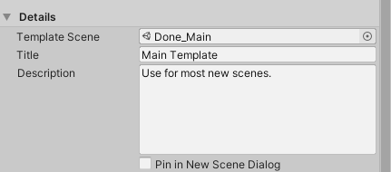
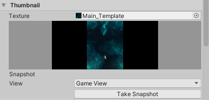
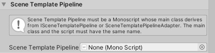

# Editing Scene templates

To edit a Scene template, select it in the [Project window](https://docs.unity3d.com/Manual/ProjectView.html), then open it in an [Inspector window](https://docs.unity3d.com/Manual/UsingTheInspector.html).

> [!NOTE]
> When you first create an [empty Scene template](creating-scene-templates.md#creating-an-empty-scene-template), you must edit its properties to associate it with a Scene before you can use it. Templates that you create from the active Scene, or an existing Scene Asset, have some properties set by default.

 _The Scene template Inspector_

The Scene template Inspector has the following sections:

1. **[Details](#details)**: Specifies which Scene the template uses, and contains  the template description that appears in the New Scene dialog.
1. **[Thumbnail](#thumbnail)**: Provides options for creating a preview image for the template.
1. **[Scene Template Pipeline](#scene-template-pipeline)**: Specifies an optional custom script to run when Unity creates a new Scene from the template.
1. **[Dependencies](#dependencies)**: Lists the template Scene's dependencies, and specifies whether Unity clones them when it creates a new Scene from the template.

### Details

Use the Details section to specify which Scene to use for a template, and control how the template appears in the [New Scene dialog](creating-scenes-from-templates.md).

 

|Property:||Description:|
|-|-|-|
|**Template Scene**   |   | Specifies the Scene to use as a template. This can be any Scene in the Project.  |
|**Title**   |   | The template name. The name you enter here appears in the [New Scene dialog](creating-scenes-from-templates.md).  |
|**Description**   |   | The template description. The description you enter here appears in the [New Scene dialog](creating-scenes-from-templates.md).  |
|**Pin in New Scene Dialog**   |   | Controls whether this template is pinned in the [New Scene dialog](creating-scenes-from-templates.md).  Pinned templates always appear at the top of the **Scene Templates in Project** list.   |

### Thumbnail

The Thumbnail section contains options for creating a preview image for the template. The preview image appears in the New Scene dialog.

 

|Property:||Description:|
|-|-|-|
|**Texture**   |   | Specifies a Texture Asset to use as a thumbnail for this template. You can use any Texture Asset in the Project.   If you don't assign a Texture, the template uses the default Scene template Asset icon. |
|**_[Thumbnail Preview]_**   |   | Displays the template's thumbnail texture, if it has one.   |
|**Snapshot**   |   | Provides options for capturing a thumbnail image for this template.  |
|  | View   | Specifies whether to capture the **Main Camera** view or the **Game View**.  |
||Take Snapshot  | Click this button to capture the selected **View**.  |  

### Scene Template Pipeline

Use these properties to add a **Scene Template Pipeline** script to this template.

 

A Scene template pipeline script lets you execute custom code when you create a new Scene from the template. See [Customizing new Scene creation](customizing-scene-instantiation.md).

### Dependencies

This section lists all of the template Scene's **Dependencies**. You can specify whether or not to **Clone** each dependency when you [create a new Scene from the template](creating-scenes-from-templates.md).

 

For each dependency in the list, toggle the **Clone** option on to clone the dependency, or off to reference the dependency.

When you create a new Scene from the template, Unity checks whether the template Scene has cloneable dependencies. If it does, Unity creates a folder with the same name as the new Scene, and puts any cloned dependencies in that folder.

For more information about cloned and referenced dependencies, see [Templates and Scene dependencies](index.md#templates-and-scene-dependencies).

To specify which types of Asset Unity clones by default, edit the [Scene template Project settings](scene-template-settings.md).

