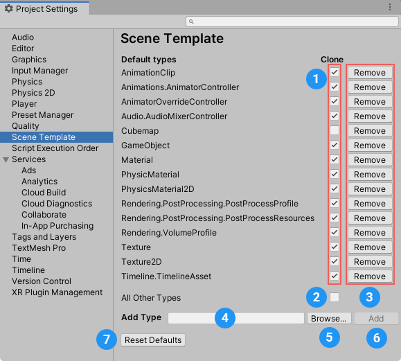
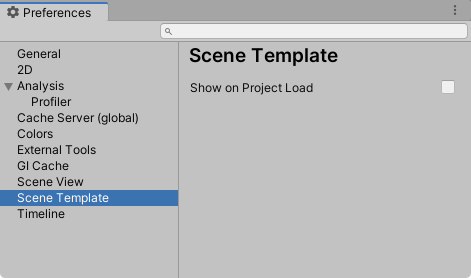

# Setting Scene template Project settings and Preferences

You can set Project settings and Preferences for Scene templates.

## Setting Scene template Project settings

The Scene template Project settings control whether Unity clones specific types of Asset by default. To access them, open the **Project Settings** window (menu: **Edit > Project Settings**) and choose **Scene Template** from the category list.

 
_The Scene template Project settings panel_

To make Unity clone a specific type of Asset by default, enable the **Clone** option (1) for that Asset type in the list.

To make Unity reference a specific type of Asset by default, disable the **Clone** option (1) for that Asset type in the list.

To set the default clone/reference behavior for Asset types that do not appear in the list, enable/disable the **Clone** option for **All Other Types** (2).

To remove an Asset type from the list, click the **Remove** button (3).

To add an Asset type to the list, do one of the following:
- In the **Add Type** field (4), enter a specific Asset type.
- Click the **Browse** button (5) to open a search window where you can find and select a specific Asset type.

Then Click the **Add** button (6) to add the Asset type to the list.

To revert to Unity's default Asset type list and settings, click the **Reset Defaults** button (7).

## Setting Scene template Preferences

To access Scene templates Preferences, open the **Preferences** window (Windows menu: **Edit > Preferences** macOS menu: **Unity > Preferences**) and choose **Scene Template** from the category list.

 
_The Scene template Preferences panel_

You can set the following preferences:

|Preference:|Description:|
|-|-|
|**Show on Project Load**   | Enable this option to make Unity open the [**New Scene** dialog](creating-scenes-from-templates.md) automatically when you load a Project without a Scene.  |