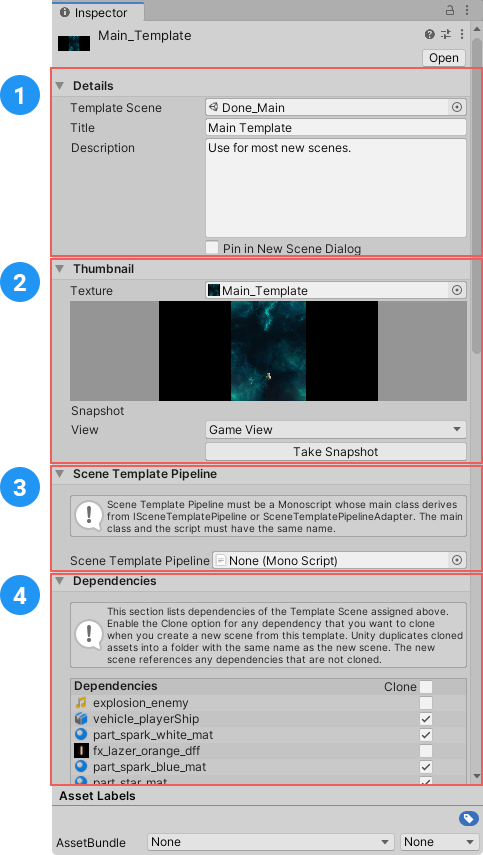

# Creating Template

There is 2 ways to create a new scene template:

## Creating a template from the active scene

If you want your current active scene to become a template, execute Menu `File -> Save Scene Template...`.

1. If the active scene is dirty or hasn't been saved you will be ask to save it.
2. You will then be prompted to save and name the template in your project.

The template is created an ready to go!

## Creating template from a scene asset

You can right click on a Scene Asset in the Project Browser and select *Create/Scene Template From Scene*.

Alternatively you can create an empty template (not bound to a scene) by right clicking anywhere in the Project Browser and selecting *Create/Scene Template*.

## Managing cloneable dependencies

If you select a Template Asset a special inspector will allow you to modify any template properties.

You can change the title or description. Those values are only used in the New Scene Dialog (see below).

You can also assign a preview texture to the scene Template. Either an existing `Texture2D` or you can use the *Screenshot ui* to take a capture of any camera and use this as the scene preview.

You can access all the dependencies of the template scene. For each of those dependency you can select if you want to reference it in a new scene instance or clone it.

Cloned dependencies will be put in a folder with the same name as the new scene instance.

## Cloneable assets in a template scene folder

When setupping your scene and before creating a template, you can create a folder with the same name as the scene. Any assets in that folder that are referenced in the scene will automatically be flagged as a *cloneable* dependency.

# Instantiate scene from template

When you include the scene template package in your project it replaces the main menu item: `File -> New Scene` with its own item that will pop a New Scene Dialog that supports templates.

## Instantiate Template Dialog

From this dialog you have multiple option:

1. Create an empty scene (`Defaults -> Empty`)
2. Create a default scene ((`Defaults-> Basic`)): single Camera and a Directional Light
3. All the other entries are Scene Template Assets in your project

## Adding new Default Templates

From a Scene Template, you can toggle the `Add To Defaults` switch. This will make the template part of the `Defaults template list`. As soon as you have a user defined default template, we remove the `Basic` template as it is all but meaningless.

## Load Additive

If you click the *Create Additive* option, the new scene will be instantiated as an additive scene in the current scene.

## Instantiate a scene with clonable dependencies

When instantiating a template containing cloneable assets the following will happen:

1. The user will be ask for a folder where to save the scene
2. All cloneable dependencies will be copied in a folder next to the new scene.
3. All references in the new scene will be updated to point to the cloned dependencies.

## Instantiate a scene without clonable dependencies

If the template doesn't contain any cloneable dependencies, the new scene instance will be created *in memory* without asking the user to save the scene on disk. No assets will be copied or cloned.